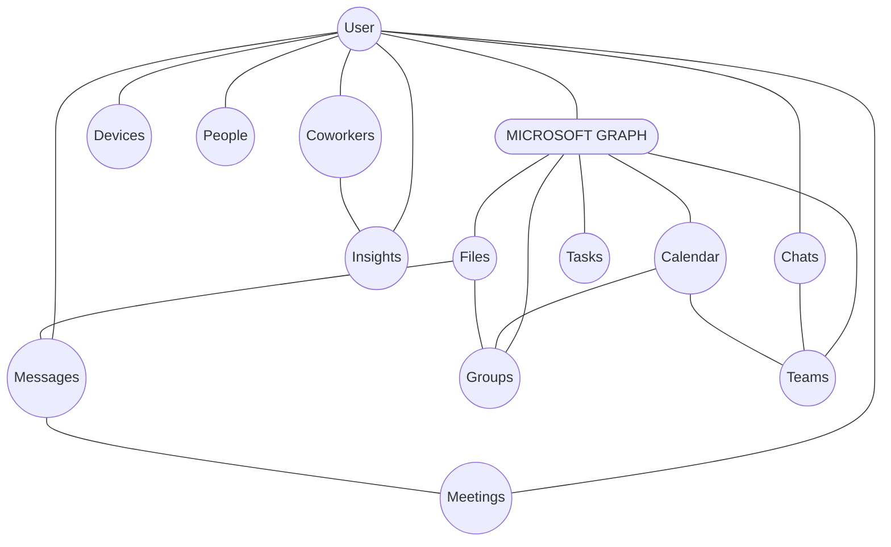

# Microsoft Graph Copilot

```mermaid
graph TD
    User((User))
    MicrosoftGraph([MICROSOFT GRAPH])

    User --- MicrosoftGraph

    User --- Devices((Devices))
    User --- People((People))
    User --- Messages((Messages))
    User --- Meetings((Meetings))
    User --- Chats((Chats))
    User --- Coworkers((Coworkers))
    User --- Insights((Insights))

    MicrosoftGraph --- Calendar((Calendar))
    MicrosoftGraph --- Files((Files))
    MicrosoftGraph --- Groups((Groups))
    MicrosoftGraph --- Teams((Teams))
    MicrosoftGraph --- Tasks((Tasks))

    Chats --- Teams
    Calendar --- Teams
    Calendar --- Groups
    Files --- Groups
    Files --- Messages
    Messages --- Meetings
    Coworkers --- Insights

```