## Architecture
The architecture of the Prompt Chaining application is based on a workflow pattern that involves multiple AI-driven steps. The system is designed to handle requests for generating technical documentation by following a structured process.

# Prompt Chaining

Prompt Chaining is a workflow application designed to automate the generation of technical documentation through a series of predefined steps. It leverages AI models to create, evaluate, and finalize documentation outlines, ensuring they meet specified criteria before generating the full documentation.

## Table of Contents
1. [Overview](#overview)
2. [Usage](#usage)
3. [Architecture](#architecture)

## Overview
The Prompt Chaining project is a workflow application that automates the creation of technical documentation. It uses a sequence of AI-driven steps to generate an outline, evaluate it against criteria, and produce the final documentation. The application is built using Cloudflare Workers and integrates with AI models to perform its tasks.

## Usage
To start the project locally, use the following command:
```bash
npx nx dev prompt-chaining
```

### API Endpoints
- **POST /**: Triggers a new workflow instance.
  - **Request**: JSON payload with a `prompt` property.
  - **Response**: JSON with `id` and `details` of the workflow instance.
  - **Curl Command**:
    ```bash
    curl -X POST http://localhost:8787/ -H "Content-Type: application/json" -d '{"prompt": "Your prompt here"}'
    ```

- **GET /:id**: Fetches the status of an existing workflow instance by ID.
  - **Response**: JSON with the status of the workflow instance.
  - **Curl Command**:
    ```bash
    curl http://localhost:8787/{id}
    ```
    
### System Diagram
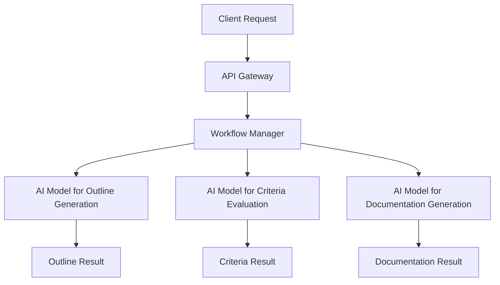

### Prompt Chaining Pattern
The project uses the **Prompt Chaining** pattern, which involves sequential decomposition into fixed subtasks. This pattern is ideal for predictable tasks that can be broken down into simple steps, such as generating an outline, verifying it against criteria, and completing the documentation.

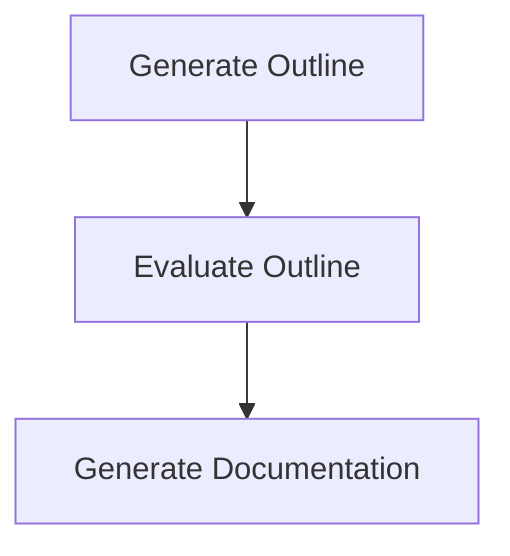

## Connect Claude Desktop to your remote MCP server

Update the Claude configuration file to point to your `workers.dev` URL (ex: `worker-name.account-name.workers.dev/sse`) and restart Claude 

```json
{
  "mcpServers": {
    "math": {
      "command": "npx",
      "args": [
        "mcp-remote",
        "https://worker-name.account-name.workers.dev/sse"
      ]
    }
  }
}
```


## Connect Claude Desktop to your local MCP server

The MCP inspector is great, but we really want to connect this to Claude! Follow [Anthropic's Quickstart](https://modelcontextprotocol.io/quickstart/user) and within Claude Desktop go to Settings > Developer > Edit Config to find your configuration file.

Open the file in your text editor and replace it with this configuration:

```json
{
  "mcpServers": {
    "math": {
      "command": "npx",
      "args": [
        "mcp-remote",
        "http://localhost:8787/sse"
      ]
    }
  }
}
```

## Architecture
The project is structured as a cloud-based application using Cloudflare Workers. It employs a routing workflow to process prompts and generate responses. The architecture includes AI models for evaluating and responding to prompts.

### System Diagram
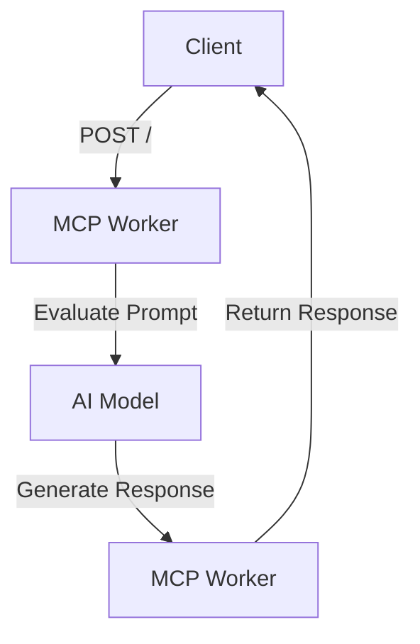

# Prompt Chaining

Prompt Chaining is a workflow application designed to automate the generation of technical documentation through a series of predefined steps. It leverages AI models to create, evaluate, and finalize documentation outlines, ensuring they meet specified criteria before generating the full documentation.

## Architecture
The architecture of the Prompt Chaining application is based on a workflow pattern that involves multiple AI-driven steps. The system is designed to handle requests for generating technical documentation by following a structured process.

### System Diagram


### Prompt Chaining Pattern
The project uses the **Prompt Chaining** pattern, which involves sequential decomposition into fixed subtasks. This pattern is ideal for predictable tasks that can be broken down into simple steps, such as generating an outline, verifying it against criteria, and completing the documentation.


### Agentic Design Patterns
#### Routing
This project uses the Routing pattern to classify and direct tasks based on the complexity of the input prompt. It evaluates the prompt and selects the appropriate AI model to generate a response.

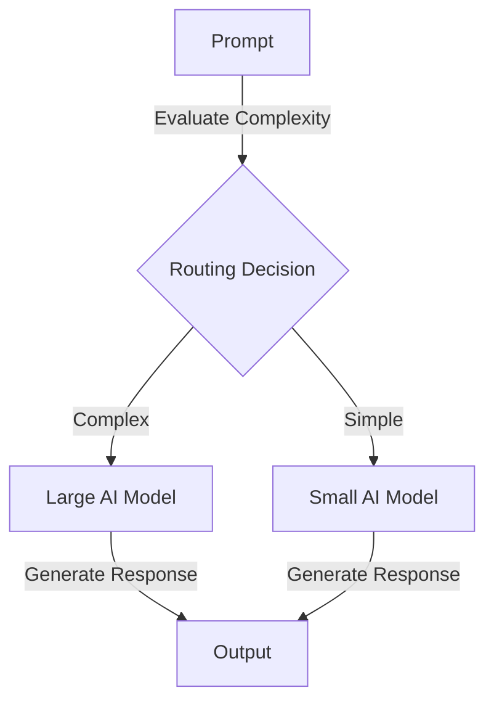
# Orchestrator Workers

This project is designed to manage complex coding tasks by breaking them down into subtasks, executing them in parallel, and synthesizing the results. It leverages AI models to orchestrate and execute these tasks efficiently.


## Architecture
The architecture of the Orchestrator Workers project is designed to efficiently manage and execute complex tasks using AI models. The system is divided into three main components:

1. **Orchestrator**: Generates subtasks from a given prompt using a large AI model.
2. **Workers**: Execute each subtask in parallel using smaller, specialized AI models.
3. **Aggregator**: Synthesizes the responses from the workers into a final result.

### System Diagram
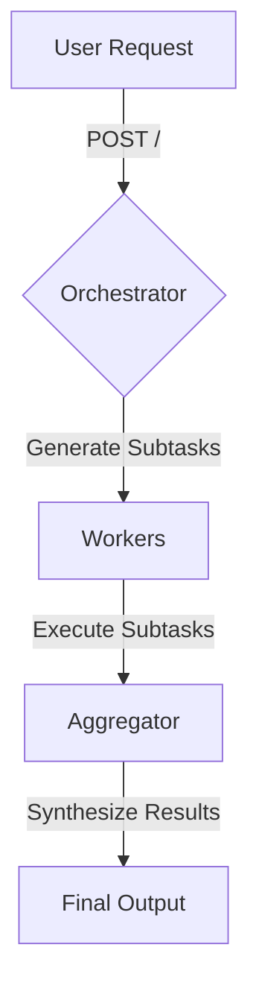

### Agentic Patterns
The project employs the **Orchestrator-Workers** pattern, where a central orchestrating AI dynamically assigns subtasks to worker AIs. This pattern is ideal for complex tasks with unpredictable subtask decomposition.

#### Orchestrator-Workers Pattern
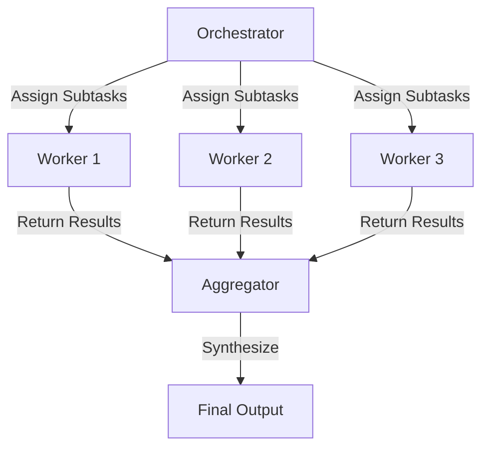

# Parallelisation

Parallelisation is a project designed to execute tasks concurrently using a workflow pattern that leverages AI models for efficient processing. The project focuses on analyzing prompts from multiple perspectives and synthesizing a comprehensive result.


## Architecture
The project uses a parallelisation workflow pattern, where tasks are divided into simultaneous operations. This is achieved through the use of multiple AI models that analyze a prompt from different angles, and the results are aggregated to form a final output.

### System Diagram
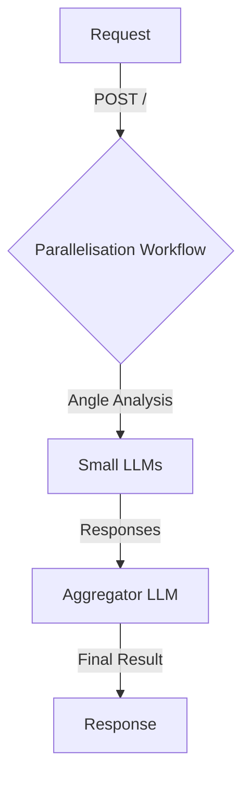

### Parallelisation Pattern
The project implements the Parallelisation pattern, where tasks are divided into simultaneous LLM operations. This involves sectioning tasks into independent parallel subtasks, allowing for efficient processing and diverse perspectives.

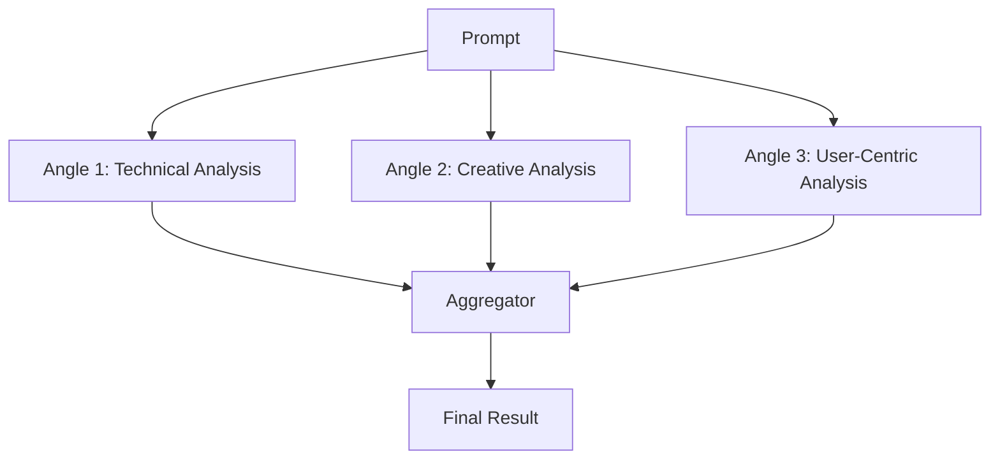
# Tool Calling Stream

Tool Calling Stream is a project designed to provide a streaming interface for AI models, allowing them to interact with external tools dynamically. The project leverages AI models to process user prompts and execute tasks such as fetching weather information.

## Architecture
The architecture of the Tool Calling Stream project is designed to facilitate real-time interaction between AI models and external tools. The system is built using the Hono framework and integrates with Workers AI for model execution.

### System Diagram
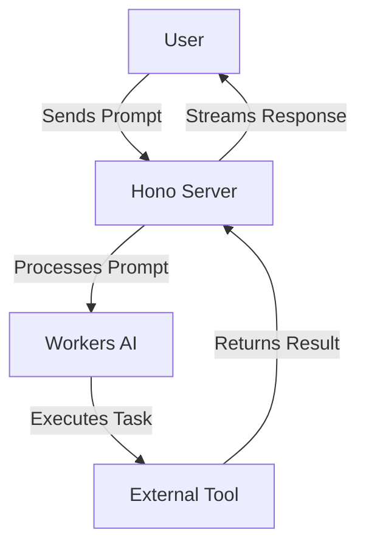

### Agentic Patterns
The project utilizes the **Tool Use Pattern**, where the AI model dynamically interacts with external tools to extend its capabilities. This pattern involves identifying tasks, invoking appropriate tools, and integrating returned data into the workflow.

#### Tool Use Pattern Diagram
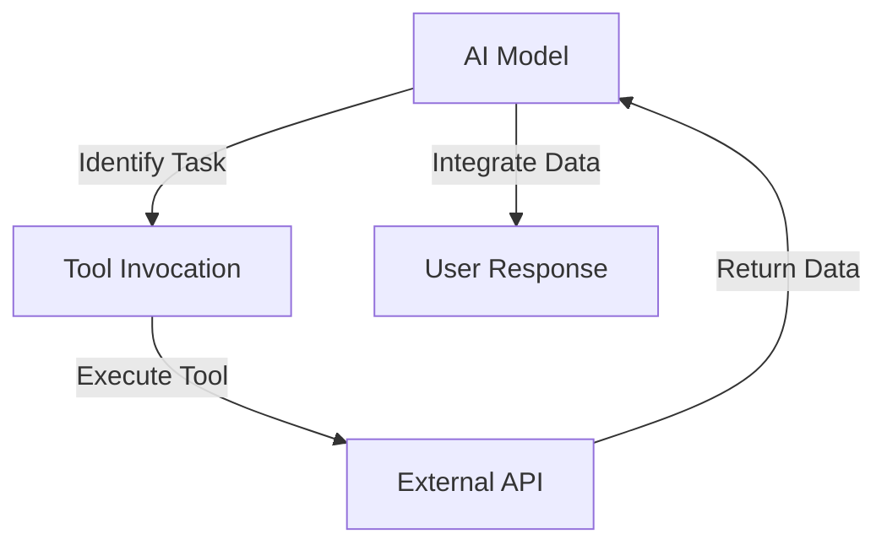

# UI Worker

This project is a web application built with Vite, React, and TypeScript. It features a chat interface that interacts with an AI model to generate, evaluate, and optimize text drafts. The application is designed to run on Cloudflare Workers, providing a scalable and efficient serverless environment.

## Architecture
The UI Worker project is structured as a serverless application running on Cloudflare Workers. It consists of a client-side React application and a server-side API that interacts with OpenAI models.

### System Diagram
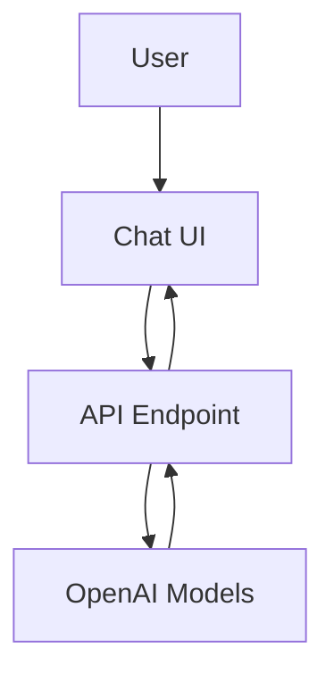

### Agentic Patterns
The project uses the Evaluator-Optimizer pattern, where the AI model iteratively refines text drafts based on evaluation feedback.

#### Evaluator-Optimizer Pattern
This pattern involves an iterative refinement loop between task execution and evaluation. In this project, the AI model generates an initial draft, evaluates it, and optimizes it based on feedback.

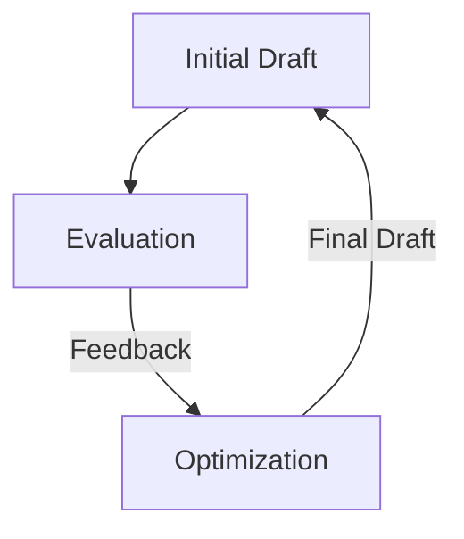

# Agent Scheduler

Agent Scheduler is a sophisticated application designed to manage scheduling operations using AI-driven decision-making. It allows users to add, cancel, and list scheduled tasks through natural language queries, leveraging advanced language models to interpret and execute user commands.

## Architecture
The Agent Scheduler is an application that uses a combination of AI models and a durable object pattern to manage scheduling tasks. The core component is the `SchedulerAgent`, which handles the state and logic for scheduling operations.

### Flow Chart
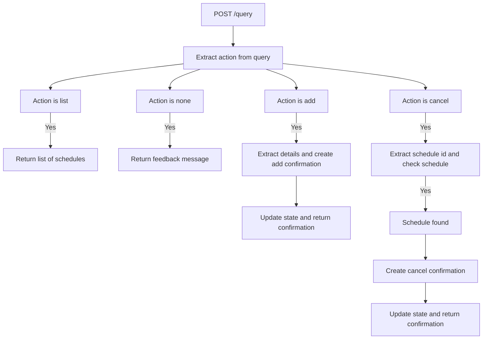

### Agentic Patterns
The project employs several agentic patterns:

#### Tool Use Pattern
The SchedulerAgent dynamically interacts with external AI models to interpret user queries and determine scheduling actions.

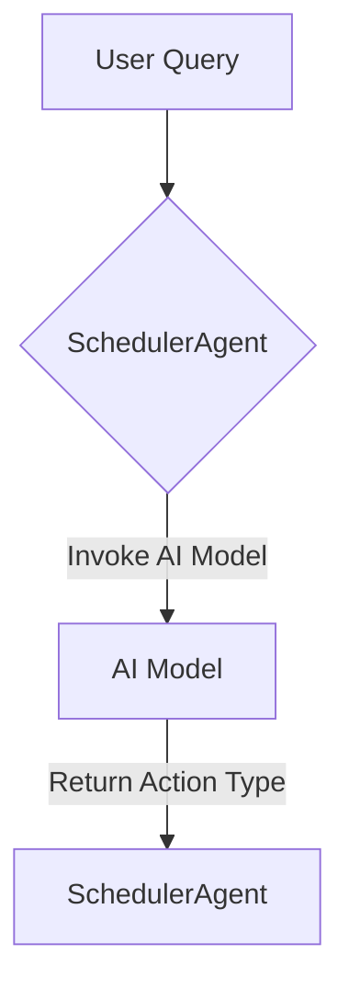

#### Planning Pattern
The SchedulerAgent formulates and executes plans based on user queries, aligning with real-time goals.

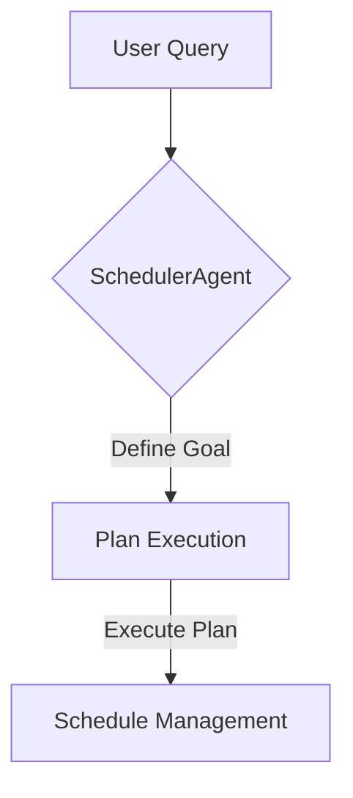

#### Autonomous Agent
The SchedulerAgent operates autonomously, managing tasks dynamically and seeking feedback from the environment.

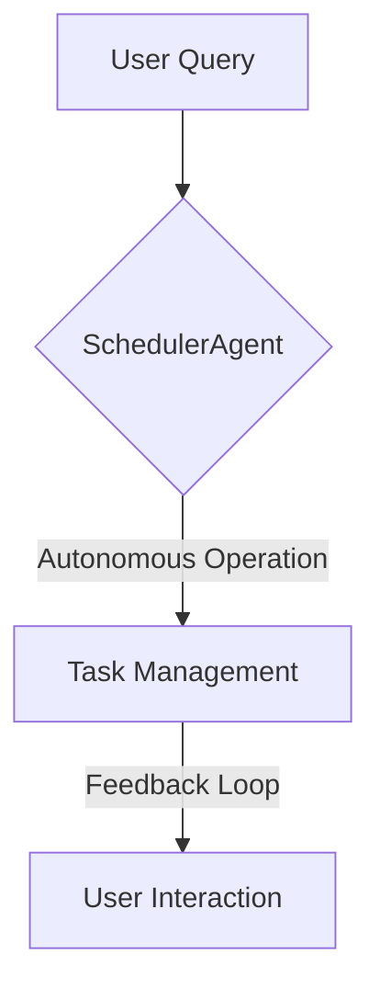

# Agent Task Manager Human In The Loop

This project is an intelligent task management system that leverages AI to manage tasks with human-in-the-loop confirmations. It allows users to add, delete, and list tasks, with actions requiring human approval before execution.

## Architecture
The system is built as an application using Durable Objects to manage state. It employs a human-in-the-loop pattern to ensure that AI-generated actions are confirmed by a human before execution.

### System Diagram
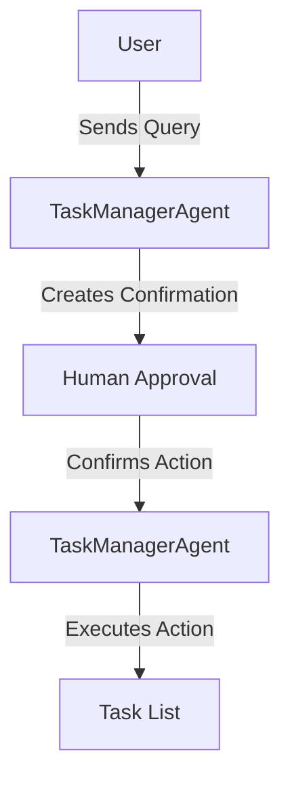

### Agentic Patterns
#### Tool Use Pattern
The system uses the Tool Use Pattern by dynamically interacting with AI models to determine task actions and confirmations.

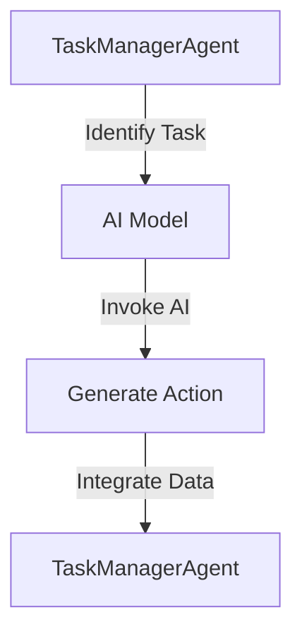

#### Autonomous Agent
The TaskManagerAgent acts as an autonomous agent, managing tasks dynamically and seeking human feedback for confirmations.

```mermaid
graph TD;
    A[TaskManagerAgent] -->|Manage Tasks| B[Human Feedback]
    B -->|Provide Feedback| A
```

# Agent Task Manager

Agent Task Manager is an intelligent task management system that leverages AI to manage tasks dynamically. It can add, delete, and list tasks based on user prompts, making it a versatile tool for task automation.

## Architecture
The Agent Task Manager is structured as a cloud-based application using Durable Objects to maintain state across sessions. The main components include the TaskManagerAgent, which handles task operations, and the API server, which facilitates communication with clients.

### System Diagram
```mermaid
graph TD;
    A[Client] --> B[API Server];
    B --> C[TaskManagerAgent];
    C --> D[Task Storage];
```

### Agentic Patterns
The project utilizes the following agentic patterns:

#### Tool Use Pattern
The TaskManagerAgent dynamically interacts with AI models to process user prompts and manage tasks.

```mermaid
graph TD;
    A[User Prompt] --> B[TaskManagerAgent];
    B --> C[AI Model];
    C --> D[Task Action];
```

#### Planning Pattern
The agent formulates plans to manage tasks based on user input, ensuring efficient task handling.

```mermaid
graph TD;
    A[Define Goal] --> B[Analyse Resources];
    B --> C[Generate Plan];
    C --> D[Execute Plan];
```

This README provides a comprehensive guide to understanding and using the Agent Task Manager project, highlighting its capabilities and architecture.

# Evaluator Optimiser

Evaluator Optimiser is a sophisticated workflow application designed to iteratively refine and optimize textual drafts using AI models. It leverages a combination of large and small language models to generate, evaluate, and enhance text based on feedback.

## Architecture
The Evaluator Optimiser application follows a structured workflow pattern known as the Evaluator-Optimizer pattern. This involves an iterative loop where a draft is generated, evaluated, and optimized based on feedback.

### System Diagram
```mermaid
graph TD;
    A[User Request] --> B[Generate Initial Draft];
    B --> C[Evaluate Draft];
    C -->|Needs Revision| D[Optimize Draft];
    C -->|No Revision Needed| E[Final Draft];
    D --> E;
```

### Evaluator-Optimizer Pattern
The Evaluator-Optimizer pattern is a workflow pattern where tasks are iteratively refined through a loop of execution and evaluation. In this project, the pattern is implemented as follows:

- **Step 1**: Generate an initial draft using a small language model.
- **Step 2**: Evaluate the draft for improvements using the same model.
- **Step 3**: If revisions are needed, optimize the draft using a larger model.

This pattern ensures that the output is continuously improved until it meets the desired quality standards.

### For Production
Create a new [Google Cloud OAuth App](https://cloud.google.com/iam/docs/workforce-manage-oauth-app): 
- For the Homepage URL, specify `https://mcp-google-oauth.<your-subdomain>.workers.dev`
- For the Authorization callback URL, specify `https://mcp-google-oauth.<your-subdomain>.workers.dev/callback`
- Note your Client ID and generate a Client secret. 
- Set secrets via Wrangler
```bash
wrangler secret put GOOGLE_CLIENT_ID
wrangler secret put GOOGLE_CLIENT_SECRET
wrangler secret put COOKIE_ENCRYPTION_KEY # add any random string here e.g. openssl rand -hex 32
wrangler secret put HOSTED_DOMAIN # optional: use this when restrict google account domain
```
#### Set up a KV namespace
- Create the KV namespace: 
`wrangler kv:namespace create "OAUTH_KV"`
- Update the Wrangler file with the KV ID

#### Deploy & Test
Deploy the MCP server to make it available on your workers.dev domain 
` wrangler deploy`

Test the remote server using [Inspector](https://modelcontextprotocol.io/docs/tools/inspector): 

```
npx @modelcontextprotocol/inspector@latest
```
Enter `https://mcp-google-oauth.<your-subdomain>.workers.dev/mcp` and hit connect. Once you go through the authentication flow, you'll see the Tools working: 


You now have a remote MCP server deployed! 

### Access Control

This MCP server uses Google Cloud OAuth for authentication. All authenticated Google users can access basic tools like "add". When you restrict users with hosted domain, set `HOSTED_DOMAIN` env.

### Access the remote MCP server from Claude Desktop

Open Claude Desktop and navigate to Settings -> Developer -> Edit Config. This opens the configuration file that controls which MCP servers Claude can access.

Replace the content with the following configuration. Once you restart Claude Desktop, a browser window will open showing your OAuth login page. Complete the authentication flow to grant Claude access to your MCP server. After you grant access, the tools will become available for you to use. 

```
{
  "mcpServers": {
    "math": {
      "command": "npx",
      "args": [
        "mcp-remote",
        "https://mcp-google-oauth.<your-subdomain>.workers.dev/mcp"
      ]
    }
  }
}
```

Once the Tools (under 🔨) show up in the interface, you can ask Claude to use them. For example: "Could you use the math tool to add 23 and 19?". Claude should invoke the tool and show the result generated by the MCP server.

### For Local Development
If you'd like to iterate and test your MCP server, you can do so in local development. This will require you to create another OAuth App on Google Cloud: 
- For the Homepage URL, specify `http://localhost:8788`
- For the Authorization callback URL, specify `http://localhost:8788/callback`
- Note your Client ID and generate a Client secret. 
- Create a `.dev.vars` file in your project root with: 
```
GOOGLE_CLIENT_ID=your_development_google_cloud_oauth_client_id
GOOGLE_CLIENT_SECRET=your_development_google_cloud_oauth_client_secret
```

#### Develop & Test
Run the server locally to make it available at `http://localhost:8788`
`wrangler dev`

To test the local server, enter `http://localhost:8788/mcp` into Inspector and hit connect. Once you follow the prompts, you'll be able to "List Tools". 

#### Using Claude and other MCP Clients

When using Claude to connect to your remote MCP server, you may see some error messages. This is because Claude Desktop doesn't yet support remote MCP servers, so it sometimes gets confused. To verify whether the MCP server is connected, hover over the 🔨 icon in the bottom right corner of Claude's interface. You should see your tools available there.

#### Using Cursor and other MCP Clients

To connect Cursor with your MCP server, choose `Type`: "Command" and in the `Command` field, combine the command and args fields into one (e.g. `npx mcp-remote https://<your-worker-name>.<your-subdomain>.workers.dev/mcp`).

Note that while Cursor supports HTTP+SSE servers, it doesn't support authentication, so you still need to use `mcp-remote` (and to use a STDIO server, not an HTTP one).

You can connect your MCP server to other MCP clients like Windsurf by opening the client's configuration file, adding the same JSON that was used for the Claude setup, and restarting the MCP client.

## How does it work? 

#### OAuth Provider
The OAuth Provider library serves as a complete OAuth 2.1 server implementation for Cloudflare Workers. It handles the complexities of the OAuth flow, including token issuance, validation, and management. In this project, it plays the dual role of:

- Authenticating MCP clients that connect to your server
- Managing the connection to Google Cloud's OAuth services
- Securely storing tokens and authentication state in KV storage

#### Durable MCP
Durable MCP extends the base MCP functionality with Cloudflare's Durable Objects, providing:
- Persistent state management for your MCP server
- Secure storage of authentication context between requests
- Access to authenticated user information via `this.props`
- Support for conditional tool availability based on user identity

#### MCP Remote
The MCP Remote library enables your server to expose tools that can be invoked by MCP clients like the Inspector. It:
- Defines the protocol for communication between clients and your server
- Provides a structured way to define tools
- Handles serialization and deserialization of requests and responses
- Supports both Streamable HTTP (recommended) and Server-Sent Events (SSE) protocols for client communication

## Transport Protocol Migration

This example has been updated to support the new **Streamable HTTP** transport protocol, which replaces the deprecated Server-Sent Events (SSE) protocol. The server now exposes both endpoints:

- `/mcp` - **Recommended**: Uses the new Streamable HTTP protocol
- `/sse` - **Deprecated**: Legacy SSE protocol (maintained for backward compatibility)

All new integrations should use the `/mcp` endpoint. The SSE endpoint will be removed in a future version.